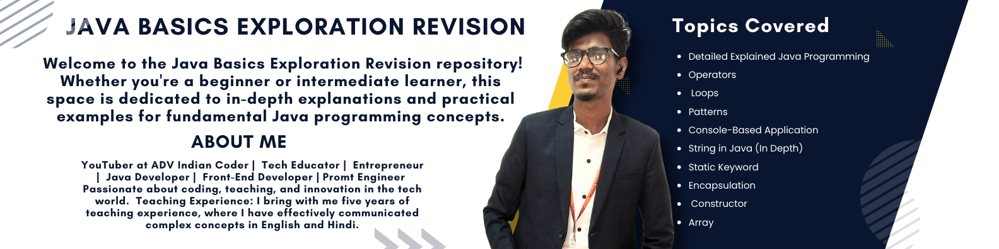

# ☕ Java Basics Exploration Revision

# 🎉 Welcome to the Java Basics Exploration Revision repository! 🚀

This repository is dedicated to providing in-depth explanations and practical examples for fundamental Java programming concepts. Whether you're a beginner looking to strengthen your foundation or an intermediate learner aiming for a comprehensive review, you're in the right place.

## 🌈 Topics Covered:

### 1. 📘 Detailed Explained Java Programming:
   - In-depth exploration of Java syntax, structure, and fundamental programming concepts.

### 2. ➕ Operators:
   - Comprehensive coverage of Java operators, including arithmetic, relational, logical, and bitwise operators.

### 3. 🎭 Control Statements:

Introduction to control statements in Java, including `if`, `else`, `switch`, and their usage for flow control in programs. Control statements play a crucial role in directing the flow of a program based on certain conditions or iterations. Understanding these statements is fundamental to writing effective and logical Java code.
 
#### 3.1 Selection Statement (Conditional Statement):

🔹 ##### 3.1.1 `if` Statement:
   - The `if` statement allows you to execute a block of code if a specified condition is true.

🔹 ##### 3.1.2 `if-else` Statement:
   - The `if-else` statement enables the execution of different code blocks based on a true or false condition.

🔹 ##### 3.1.3 Nested `if` Statement:
   - Nested `if` statements involve implementing multiple conditional statements within each other.

🔹 ##### 3.1.4 `switch` Statement:
   - The `switch` statement allows the selection of one code block from multiple based on the value of an expression.

#### 3.2 Iteration or Looping Statement:

🔹 ##### 3.2.1 `for` Loop:
   - The `for` loop executes a block of code repeatedly for a specified number of times.

🔹 ##### 3.2.2 `while` Loop:
   - The `while` loop repeats a block of code as long as a specified condition is true.

🔹 ##### 3.2.3 `do-while` Loop:
   - The `do-while` loop is similar to `while`, but it guarantees the execution of the block at least once.

#### 3.3 Jump Statement:

🔹 ##### 3.3.1 `break` Statement:
   - The `break` statement terminates the loop or switch statement and transfers control to the statement following the terminated statement.

🔹 ##### 3.3.2 `continue` Statement:
   - The `continue` statement skips the rest of the loop's code and proceeds to the next iteration.

🔹 ##### 3.3.3 `return` Statement:
   - The `return` statement exits from a method, optionally returning a value. Note: `return` with a value is more commonly used in Java compared to C.

### 4. ✨ Patterns:
   - Practical examples and explanations for creating various patterns using Java programming constructs.

### 5. 🖥️ Console-Based Application:
   - Hands-on experience in building console-based applications in Java.

### 6. 🔍 String in Java (In Depth):
   - Detailed exploration of Java's String class, covering manipulation, comparison, and common string-related operations.

### 7. 🌐 Static Keyword:
   - Understanding the usage and implications of the `static` keyword in Java.

### 8. 🛡️ Encapsulation:
   - Comprehensive coverage of encapsulation principles in Java, promoting data hiding and access control.

### 9. 🛠️ Constructor:
   - In-depth exploration of constructors in Java, including parameterized and default constructors.

### 10. 🎯 Array:
    - Mastering the usage of arrays in Java, including one-dimensional and multi-dimensional arrays.

    

## 🚀 How to Use This Repository:

- Each topic is organized into its dedicated directory.
- Navigate to the respective directories to find detailed explanations, code examples, and practice exercises.
- Code snippets and examples are provided to reinforce understanding.
- Feel free to experiment with the code, modify it, and run it in your Java development environment.

## 🌟 Why Explore Java Basics:

- Strengthen your foundation in Java programming.
- Build confidence in writing clear and concise Java code.
- Prepare yourself for more advanced Java concepts.

## 🤝 Contribution:

Contributions are welcome! If you have additional examples, exercises, or improvements to the existing content, feel free to open a pull request.

Happy coding! 🚀

